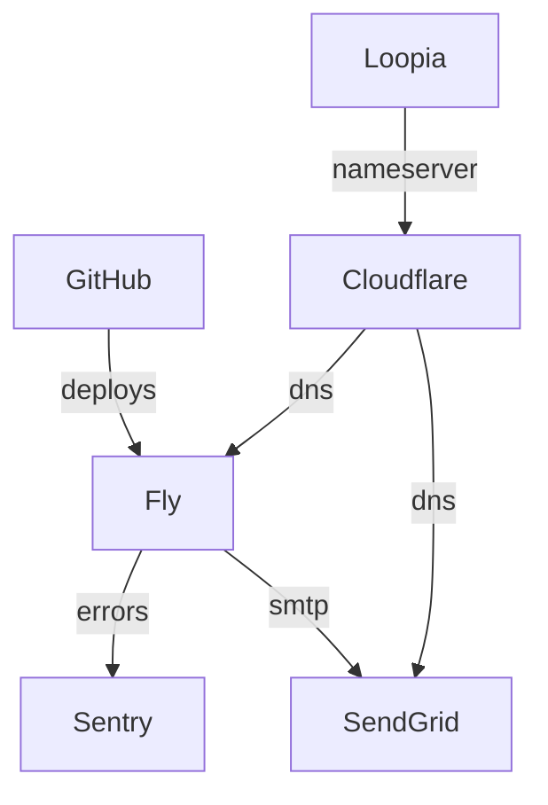

# 666:a

## Setup

```bash
git clone git@github.com:henrycatalinismith/666a.git
```

## Services



## Dependencies

| Name   | Version  |
|--------|----------|
| Ruby   | 3.2.2    |
| Docker | 20.10.21 |
| SQLite | 3.39.5   |

## Environment

| Name               | Purpose                                        |
|--------------------|------------------------------------------------|
| `RAILS_MASTER_KEY` | Encrypting and decrypting the credentials file |
| `SENDGRID_API_KEY` | Sending email alerts                           |
| `SENTRY_DSN`       | Error logging                                  |
